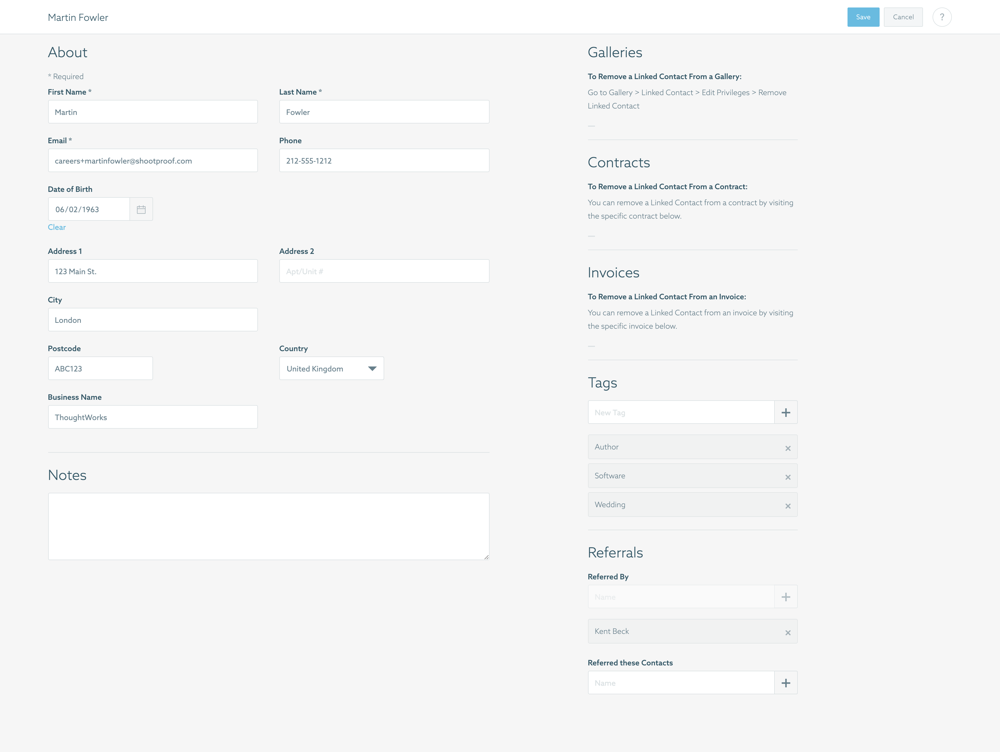

# Quality Assurance Exercise

## Overview

Here at ShootProof, we prefer to have a good idea of a candidate's technical
experience and analysis skills before proceeding with portions of our recruiting
process.  We believe that the exercises below will illustrate a candidate's
approach to working with technologies and methodologies commonly used in our
QA team here at ShootProof.

## Guidelines

The exercise consists of several different parts designed to showcase your
problem-solving and solution-implementation talents. There is not a single
correct answer; this is *not* an exam. We simply want to see how you approach a
business problem and the steps you take to solve it.

* This exercise should not take you more than two or three hours to complete. If
  your solution is taking longer, that's okay—be honest and let us know how long
  it took and why you think it took that long.
* Be as thorough as you wish.
* All exercises are to be performed as if you were on the job.
* You may submit your response in one of the following ways:
  * Package an archive (ZIP, tarball, etc.) of your files and deliver it to
    your contact.
    * If working with a recruiter, deliver it to them.
    * If working with ShootProof directly, deliver to <careers+qa@shootproof.com>.
  * Fork our repository and open a pull request.


## Exercise 1: Test plan

Below you will find two key inputs for this exercise:

* An actual implementation screenshot of the contact edit page a photographer
  would use when editing a contact within ShootProof's Studio Panel
* Acceptance criteria for the contact edit view

These materials are representative of what you would be working with in our QA
team.  A business analyst would have written the acceptance criteria, and
a developer would have implemented the contact edit page to meet its
requirements.

As a member of our QA team, you would be responsible to confirming that this
particular view meets its requirements and functions in a manner free of
defects.

Given these inputs, draft up a test plan for testing the contact edit view.
You may use any format and structure; whatever is familiar and representative
of your work style.

### Implementation screenshot



### Acceptance criteria


## Exercise 2: Test automation

You’ve been tasked to write automated tests that check the behavior of the ShootProof
marketing site home page. There’s a “GET STARTED” button on
<https://www.shootproof.com/> that you’ll need to click.

### Locating the "Get Started" button

**Goal:** provide code or pseudocode to locate the topmost "Get Started" button

Provide code for an automated test that locates the topmost "Get Started"
button on <https://www.shootproof.com>.  The code provided can be for an
automated test using the tool and language of your choice (Selenium, etc.).

A complete submission will:

* Assert that a "Get Started" button exists on the page
* Explain why you chose the language and framework that you did
* If the code and approach is not obvious, describe the approach and decisions
  made

In the event that you cannot provide working code, please provide a written
description of how you would locate this button.  Pseudocode is acceptable,
but working code is preferred.

### Locating the _other_ "Get Started" button

**Goal:** provide code or pseudocode to locate the "Get Started" button that
appears at the bottom of the page

How would you locate the other "Get Started" button, which appears at the bottom of the page?

Similarly, provide code for an automated test that locates the bottommost "Get
Started" button on <https://www.shootproof.com/>.  As in the exercise above,
the code provided can be for an automated test using the took and language of
your choice (Selenium, etc.).

A complete submission will:

* Assert that a "Get Started" button exists at the bottom of the page
* Explain why you chose the language and framework that you did
* If the code and approach is not obvious, describe the approach and decisions
  made

## (Optional) Exercise 3: JsonPath

**Goal:** locate specific values within a JSON object

ShootProof uses Karate for API testing. Part of this work is writing
[JsonPath selectors](https://github.com/json-path/JsonPath#filter-operators) to select a
particular part of a JSON object. The concept should be familiar if you’ve written
relative XPaths or SQL queries.

### Questions

Using the JSON source data below, complete the following exercises.
You may use <http://jsonpath.herokuapp.com/> to check your work.

1. Write a JsonPath that gets `totalItems` from `meta`.
1. Write a JsonPath that gets the whole `contact` object for contacts with at least two galleries
1. Write a JsonPath that gets the `tags` for the `contact` object where the contact name is "Adrastea Shahriar"

A complete submission will:

* Include a JsonPath statement for each of the three questions above

### Source data

Use the JSON data below for the following questions:

```
{
   "meta": {
       "currentPage": 1,
       "totalPages": 1,
       "totalItems": 5,
       "rows": 5
   },
   "contact": [
       {
           "id": 5,
           "name": "Manuel Makarios",
           "email": "mmakarios@gmail.com",
           "tags": ["wedding"],
           "galleriesCount": 2
       },
       {
           "id": 6,
           "name": "Kyriake Žarko",
           "email": "zarkok@yahoo.com",
           "tags": [],
           "galleriesCount": 0
       },
       {
           "id": 7,
           "name": "Tsholofelo Wacława",
           "email": "Tsholofelo@test.com",
           "tags": ["wedding"],
           "galleriesCount": 1
       },
       {
           "id": 8,
           "name": "Adrastea Shahriar",
           "email": "adrastea.shahriar@mail.com",
           "tags": ["wedding", "family"],
           "galleriesCount": 5
       },
       {
           "id": 9,
           "name": "Jacob Klava",
           "email": "jklava7@aol.com",
           "tags": ["graduation", "family"],
           "galleriesCount": 3
       }
   ]
}
```
